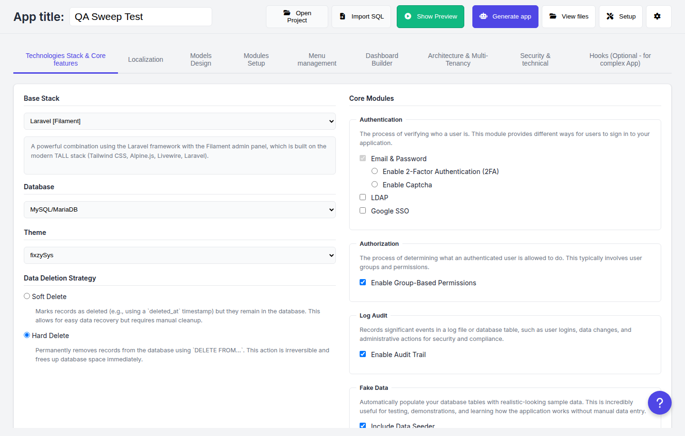
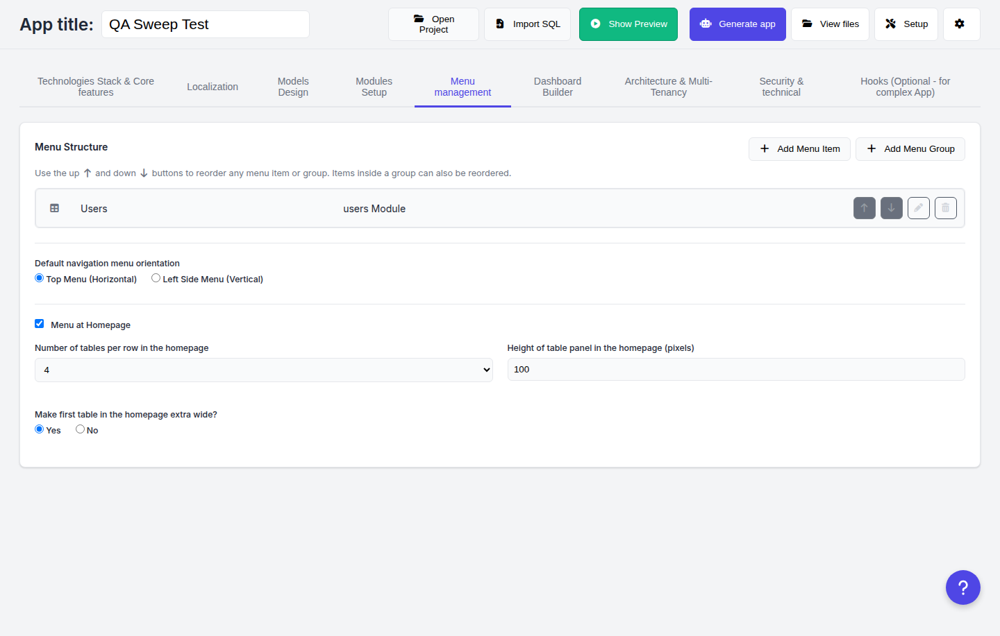
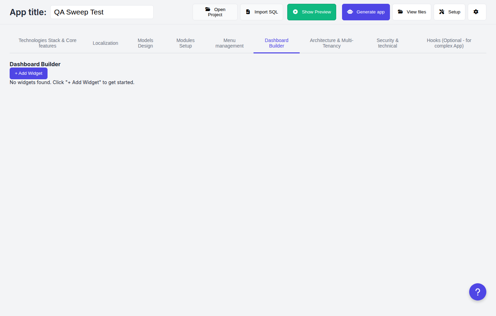
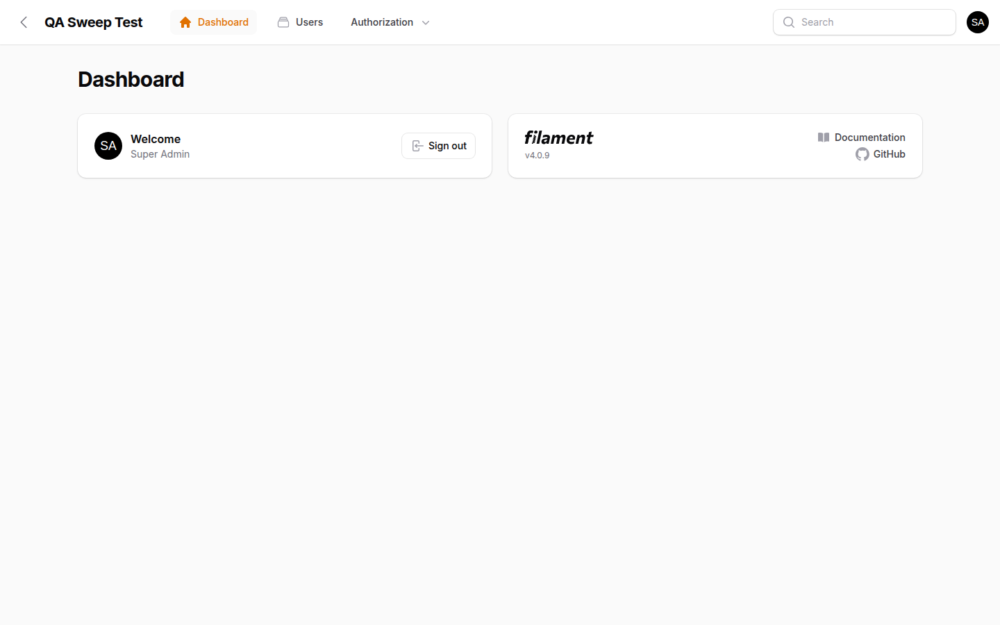

# Fixzy SysMaker

**Visual database designer that builds your admin back office.**

Describe your database — visually, or by importing an existing SQL dump — and get
a complete, production-ready admin system: migrations, models, resources, forms,
tables, CSV importers/exporters, audit trail, multi-tenancy, factories, and
deployment docs. Generated code is plain, readable app code — no proprietary
runtime, no lock-in.

Fixzy SysMaker is a **multi-stack generator**. Your design lives in a
stack-neutral intermediate representation (IR), and pluggable generators turn it
into real application code. **Laravel + Filament** is the first production-ready
target — the benchmark every future stack is measured against — with more stacks
on the roadmap.

Fixzy SysMaker is built for **semi-technical and non-technical users**: design
your data and admin screens through a guided interface, then hand clean,
production-quality code to your team (or deploy it yourself).

Runs three ways from one engine: **desktop app (Electron)**, **local web UI**,
and **headless CLI** for CI pipelines.

## Screenshots

Main configuration — pick stack, database, theme, deletion strategy, core modules:



Menu management — group and order the generated app's navigation:



Dashboard builder — stats and chart widgets bound to any table:



The result — a generated Laravel + Filament admin, live after one click:



---

## Installation

### Option 1 — Desktop app (recommended, easiest)

1. Download the installer for your OS from the
   [Releases](../../releases) page:
   - **Windows**: `Fixzy SysMaker Setup x.x.x.exe` (NSIS installer)
   - **macOS**: `Fixzy SysMaker x.x.x.dmg` (x64 and Apple Silicon)
2. Install and launch the app.
3. On first launch, the **Setup Wizard** checks your computer and installs
   everything it needs (PHP runtime, Composer, preview environment) with one
   click — no command line required.
4. Click **New Project** and start designing.

> You can reopen the Setup Wizard any time from the **Setup** button in the
> header to re-check or repair your environment.

### Option 2 — From source

Requirements: **Node.js 20+**. PHP 8.2+ is only needed for live preview/deploy
(the code generators themselves need no PHP).

```bash
git clone https://github.com/mohdhafizi83/fixzy-sysmaker.git
cd fixzy-sysmaker
npm install
npm run setup:binaries   # provisions PHP + composer.phar for your OS
npm start                # launches the desktop app
```

The Setup Wizard will also guide you through any missing pieces on first launch.

### Option 3 — CLI (for power users and CI)

```bash
# Local web UI (same app, in your browser)
node bin/fixzy.js serve                 # http://127.0.0.1:7788

# Generate an app from a saved project
node bin/fixzy.js generate --project "TaskFlow" --out ~/projects --zip

# Generate from a test fixture (no GUI needed — great for CI)
node bin/fixzy.js generate --fixture base_simple --out ~/projects --zip

# Inspect the store
node bin/fixzy.js list
node bin/fixzy.js fixtures
```

CLI environment variables:

| Variable | Purpose |
|---|---|
| `FSM_DATA_DIR` | Store directory (default `~/.fixzy`) |
| `FSM_PHP_BIN` | Explicit PHP binary path (skips provisioning) |
| `FSM_OUTPUT_ROOTS` | Allowed output roots (default `~/projects:$HOME`) |
| `FSM_ALLOW_REMOTE=1` | Required to bind the web UI to non-localhost |
| `FSM_DEVTOOLS=1` | Open Electron DevTools (development only) |

## Features

### Visual schema design
- **Table & field designer** — data types, lengths, defaults, validation rules,
  indexes, constraints, display types (media, repeater, lookup, and more)
- **Relationships** — one-to-many, one-to-one, many-to-many, polymorphic
- **Import existing databases** — upload or paste MySQL/MariaDB, PostgreSQL,
  SQL Server, or SQLite dumps and keep designing
- **Menu management** — group, order, and label the generated app's navigation
- **Dashboard builder** — stat cards and charts bound to any table

### What you get per generated app

| Layer | Output |
|---|---|
| Database | Migrations (FKs, indexes, soft deletes), seeders, factories |
| Models | Eloquent models with relations, `BelongsToTenant` / `HasAudits` traits |
| Admin UI | Filament resources: forms, tables, pages, relation managers |
| Data I/O | CSV importers/exporters per table, native print action |
| Security | Native audit trail (migration + observer), tenancy scoping, Shield-ready |
| Docs | In-app deployment guide |

### Target stacks

| Stack | Status |
|---|---|
| Laravel 11 + Filament (PHP) | ✅ Production-ready — the benchmark |
| Additional stacks (Node, others) | 🔜 Planned — the IR is stack-neutral by design |

The design model (tables, fields, relationships, menus, widgets) is captured in a
stack-neutral IR, so a new target stack is a new generator plugin — not a new app.
See `docs/IR_SCHEMA.json` and `docs/IR_MAPPING.md`.

### Live preview
Click **Show Preview** to run the generated app instantly in a sandboxed local
environment — log in, click around, and see your design before exporting.

### Multi-tenancy & auditing
Row-level ownership, tenant scoping (single and multi-tenant patterns), and a
generated native audit trail — no third-party auditing package required.

### Custom modules
Build screens that go beyond plain CRUD: custom views, module-level logic,
and per-table overrides.

## Roadmap

Shipped:
- [x] Multi-stack architecture: stack-neutral IR + pluggable generators
- [x] Laravel + Filament generator (full stack: DB, models, resources, I/O) — benchmark target
- [x] Desktop (Windows/macOS), local web UI, and headless CLI from one engine
- [x] SQL import (MySQL, PostgreSQL, SQL Server, SQLite)
- [x] Multi-tenancy, row ownership, native audit trail
- [x] Dashboard builder with stat/chart widgets
- [x] GUI Setup Wizard (one-click environment provisioning)
- [x] 16-fixture golden test matrix + CI (ubuntu + macOS)

Next:
- [ ] Guided project templates (CRM, inventory, booking, helpdesk starters)
- [ ] Project files: save/open designs as portable `.fixzy` files
- [ ] Workflow engine: intake → route → process → notify → track
- [ ] Additional target stacks beyond Laravel + Filament
- [ ] In-app update channel for the desktop app

Roadmap items are community-friendly — open an issue to vote or request.

## Development

```bash
node test/golden.js                 # 16-fixture snapshot matrix
node test/e2e_smoke.js <fixture>    # generate + migrate + boot + HTTP check
node test/pathguard_test.js         # security unit tests
node test/audit_headless.js         # generator crash audit
```

CI runs the full matrix on ubuntu + macOS (`.github/workflows/ci.yml`).

Key docs: `docs/FEATURE_MATRIX.md`, `docs/NATIVE_FEATURES.md`,
`docs/HEADLESS_WEB.md`, `docs/BUGS.md`.

Architecture: the app stores your design in a local SQLite database; generators
are pure functions that turn the schema into PHP files. The same IPC handler
registry powers Electron, the web shim, and the CLI — one engine, three shells.

## Security

- Binds to `127.0.0.1` by default; remote binding requires an explicit opt-in
- Output paths are allowlisted; traversal/symlink escapes are rejected
- Electron `contextIsolation` on, no `nodeIntegration`, CSP localhost-only
- Report vulnerabilities privately — see `SECURITY.md`

## License

Fixzy SysMaker is released under a **Non-Commercial license** (see
[`LICENSE.md`](LICENSE.md)): free for personal, educational, research,
government, and non-profit use. Commercial licensing is available — contact
mohdhafizi83@gmail.com.
